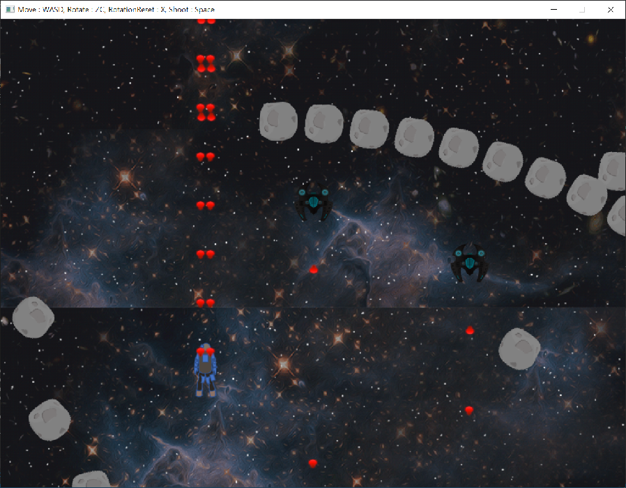

  
# Project OSC : A BulletHell Shooting Game with in-house Game Engine

## what is this project?
- A 2D space shooter game
- Bullethell Shoot'em up game using original engine
- Using open-source Image Library "SDL2"
- Currently supports Windows
- Engine code in /Core/ directory

## Language & Library
This project is written in C++, the de-facto standard language in game programming & gaming industry.
This project intentionally excludes the use of commercial engines(I.E, Unity or UE4/5) to learn the internal structure and workflow of the engine. Instead, this project uses self-made original engine using open-source library, SDL, which is designed in consideration of re-usability of other projects.
  
## Things to add
### Engine
 - memory control using **smart pointer**
 - JSONized or XMLized level file & its file I/O in engine code
 - UI
 - audio
 - solution-generating batch file(using CMake or premake or sth..)
 
### Source : additional game content
 - bullet & enemy patterns
 - bossfight
 - pick-up items, upgrade
 - level design
- UI

## Game Framework Details

### Actor
- **Actor** is an object that can be placed or spawned in game such as Player, Enemy, Bullet, Background, etc.
- Each Actor can contain Component, which is an Implementation unit that provides Actor a basic action such as Movement, Collision, Sprite(in 2D), Player Input,  Weapon, etc.
- In order to add a new Actor in source, a programmer can add a new class that inherits base Actor class and extend it to its desired design.
- To use a hybrid of Actor-Component based and Inheritance-based Monolithic structure can guide a programmer to write a highly reusable code.

### Component
- **Component** is an Implementation unit that provides Actor a basic action such as Movement, Collision, Sprite(in 2D), Player Input,  Weapon, etc.

## How to Play

- Now : Launch OSC.sln and Ctrl+F5 to build&run.
- TBD(includes .exe file or installer)

## Core Structure of Engine
- UML here

- instructions of each /Core/ classes here
### 1. /core/
### 2. /source/

## Engine Workflow
- top-down diagram here
- instruction of /Core/Game here

## Source 
- TBD

## Reference of Contributors